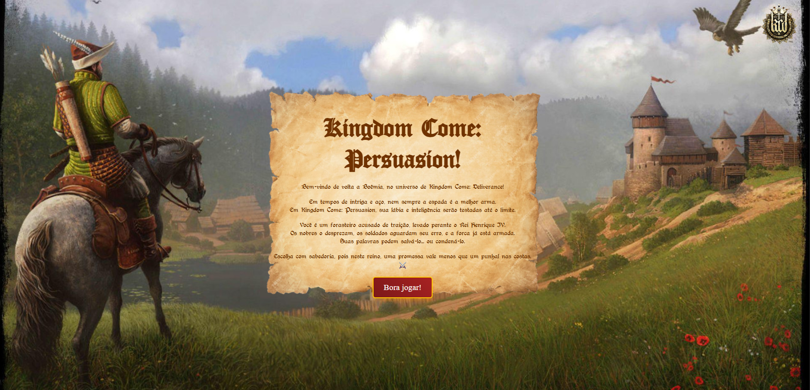
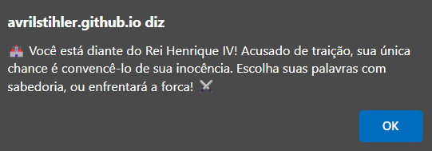
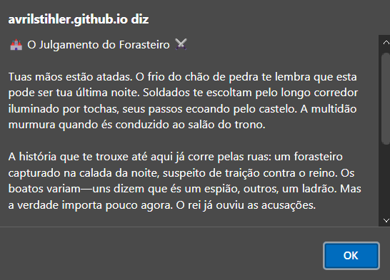
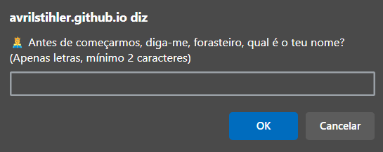
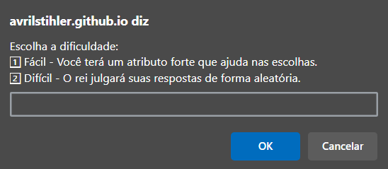
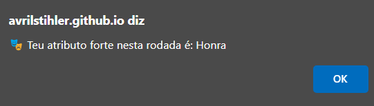
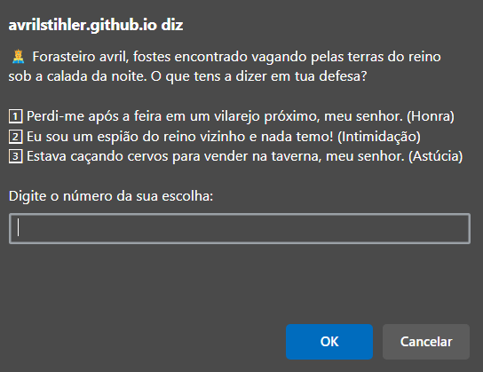
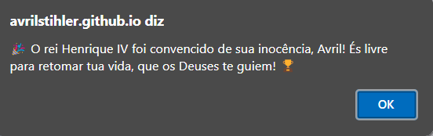
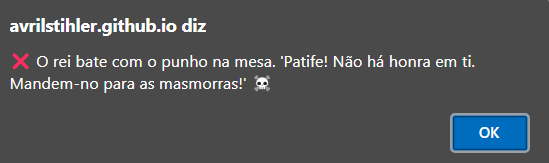
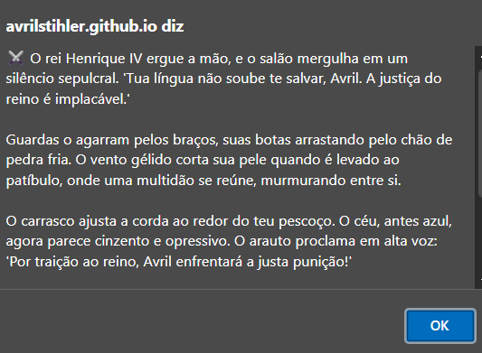

# 🏰 Kingdom Come: Persuasion

Esse jogo de decisão em texto é uma experiência interativa ambientada no universo do jogo *Kingdom Come: Deliverance*, criada durante a Imersão DEV 2025.

Ao invés de batalhas sangrentas e combates de espada, aqui o verdadeiro desafio está nas palavras. Você será colocado diante do Rei Henrique IV, acusado de traição, com o destino à beira da forca. Sua única arma? A persuasão.

Clique [aqui]() para acessar o game.

---

Ao iniciar o jogo, você será apresentado a uma narrativa imersiva no castelo do Rei Henrique IV. Você poderá escolher se deseja ler a introdução detalhada do seu julgamento.

### 🧙‍♂️ Início
- Escolha se deseja ler a **descrição narrativa do julgamento**.
- Informe seu nome (mínimo 2 letras, apenas letras).
- Escolha a **dificuldade**:
  - `1` - Fácil: Você receberá um atributo forte (Astúcia, Honra ou Intimidação) que melhora suas chances de sucesso.
  - `2` - Difícil: Suas respostas terão 50% de chance de sucesso, independentemente do atributo.

### 🎮 Sistema de Jogo

Cada pergunta apresenta três alternativas, cada uma relacionada a um atributo:
- **Astúcia**
- **Honra**
- **Intimidação**

O sucesso ou fracasso de sua resposta dependerá:
- Da dificuldade escolhida
- Do atributo da resposta
- E de um pouco de **sorte** (probabilidades definidas por `Math.random()`)

Você começa com **1 Ponto de Persuasão**, que pode ser usado para tentar responder novamente em caso de erro.

- Escolhas ruins ou azar podem levar à execução.

- Se convencer o rei em todas as perguntas, você será absolvido e viverá para contar a história!

## ✅ Exemplo de Gameplay

Abaixo está uma tabela com os prints do game, organizados por etapa:

| 🏠 Mensagem Inicial | 🤴 Descrição Detalhada | ✏️ Nome do Jogador | 
|---|---|---|
|  |  |  |

| ⚖️ Dificuldade | 👑 Atributo Forte | ❓ Pergunta |
|---|---|---|
|  |  |  |

| 🏆 Mensagem Vitória | ❌ Mensagem Derrota | ☠️ Descrição Derrota | 
|---|---|---|
|  |  |  |

## 🧾 Tecnologias Utilizadas

- **JavaScript, HTML e CSS**
- Caixa de diálogo interativa com `alert`, `prompt` e `confirm`

